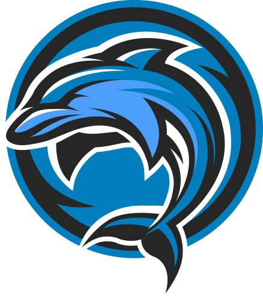

# RazX Official
## RazX by Akash Chaudhary – Launched on 28 June 2025
I started **RazX** because I couldn't find the best, most reliable packages for Linux. So, I decided to build a platform that delivers exactly that – **top-tier packages curated for your Linux system.** RazX isn’t just a package hub, it’s a growing ecosystem.

We also proudly present **RazX OS**, a Linux distribution crafted to give you speed, stability, and the very best tools right out of the box.

### Welcome to the future of Linux – built by a user, for the users.
### ---------------------------------------------------------------

,
# RazX OS – Coming Soon
## Developed by Akash Chaudhary
**RazX OS** is an upcoming **lightweight, fast, and beautifully designed Linux operating system**, built to give you a seamless and powerful computing experience.

  ⚫ **Faster performance** – optimized for speed and responsiveness

  ⚫ **Lightweight build** – runs smoothly even on low-end systems

  ⚫ **Modern desktop design** – clean, elegant, and user-friendly interface

  ⚫ **Runs on Android –** can be installed via Termux, bringing full Linux power to your mobile device

Whether you're a developer, a student, or a power user, **RazX OS** is crafted to give you the freedom and flexibility Linux is known for – with extra polish.

**Stay tuned. RazX OS is coming.**
### ---------------------------------------------------------------

#  Social Media
## Stay connected and follow my work on social platforms:
 **YouTube:** https://www.youtube.com/channel/UCacjbp5k9W5WovZJ_oFw9sA
 
Subscribe for updates, tutorials, and RazX OS development insights!

**Instagram:** https://www.instagram.com/akashh.008
 
Follow for behind-the-scenes, project sneak peeks, and Linux content!
